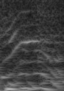
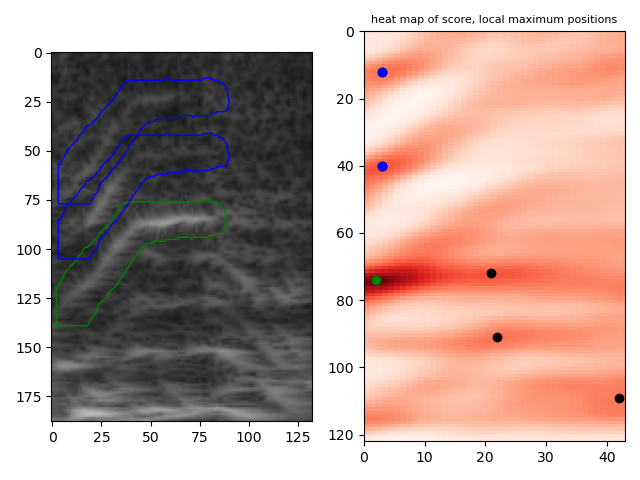
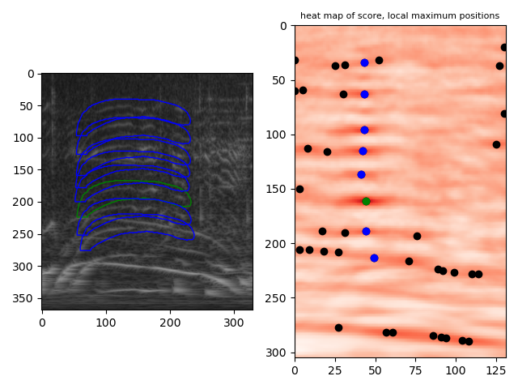

#  harmonic structure parts detect   
    
This is an experiment of voice/instrument-sound harmonic structure parts detection by template matching with mask method.  
   
[github repository](https://github.com/shun60s/harmonic-structure-parts-detect/)  

## description  

This aims to detect each parts of harmonic structure, from spectrogram specified in voice/instrument-sound portion.  
Template matching with mask method is used, because rectangle patch is inappropriate due to voice parts are bent and closed each other,
and rectangle patch cannot separate them.   

###  prepare.py  
save specified portion as an image file, from spectrogram and its annotation label file (yolo format).  

Input spectrogram sample:  
  
Output specified portion image:  
  

### make_mask.py 
make mask data (npy file) from handwritten mask define image (BMP file)  

Handwritten mask define image sample:  
  

Output mask image:  
  

### template_matching.py  
detect parts by template matching with mask method. 

Result sample: green is the template, blue ones are detected.  
  
  
  

## License  

MIT  except peak_det.py  

Regarding to peak_det.py, please refer the notice in the content.  

## related links  

- [spectrogram portion detection by YOLO](https://github.com/shun60s/YOLO-spectrogram-darknet-clone/)  

